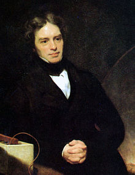

<table class="infobox biography vcard">
<tbody>
<tr>
<th colspan="2">

Michael Faraday

</th>
</tr>
<tr>
<td colspan="2">

Painting of Faraday (1842) by&nbsp;<a title="Thomas Phillips" href="https://en.wikipedia.org/wiki/Thomas_Phillips">Thomas Phillips</a>

</td>
</tr>
<tr>
<th scope="row">Born</th>
<td>22 September, 1791 

<a title="Newington Butts" href="https://en.wikipedia.org/wiki/Newington_Butts">Newington Butts</a>, England

</td>
</tr>
<tr>
<th scope="row">Died</th>
<td>25 August, 1867 (aged 75) 

<a class="mw-redirect" title="Hampton Court" href="https://en.wikipedia.org/wiki/Hampton_Court">Hampton Court</a>, Middlesex, England

</td>
</tr>
<tr>
<th scope="row">Nationality</th>
<td class="category"><a class="mw-redirect" title="British nationality" href="https://en.wikipedia.org/wiki/British_nationality">British</a></td>
</tr>
<tr>
<th scope="row">Known&nbsp;for</th>
<td><a title="Faraday's law of induction" href="https://en.wikipedia.org/wiki/Faraday%27s_law_of_induction">Faraday's law of induction</a> <a title="Electrochemistry" href="https://en.wikipedia.org/wiki/Electrochemistry">Electrochemistry</a> <a title="Faraday effect" href="https://en.wikipedia.org/wiki/Faraday_effect">Faraday effect</a> <a title="Faraday cage" href="https://en.wikipedia.org/wiki/Faraday_cage">Faraday cage</a> <a title="Faraday constant" href="https://en.wikipedia.org/wiki/Faraday_constant">Faraday constant</a> <a title="Faraday cup" href="https://en.wikipedia.org/wiki/Faraday_cup">Faraday cup</a> <a title="Faraday's laws of electrolysis" href="https://en.wikipedia.org/wiki/Faraday%27s_laws_of_electrolysis">Faraday's laws of electrolysis</a> <a title="Faraday paradox" href="https://en.wikipedia.org/wiki/Faraday_paradox">Faraday paradox</a> <a title="Faraday rotator" href="https://en.wikipedia.org/wiki/Faraday_rotator">Faraday rotator</a> <a title="Faraday-efficiency effect" href="https://en.wikipedia.org/wiki/Faraday-efficiency_effect">Faraday-efficiency effect</a> <a title="Faraday wave" href="https://en.wikipedia.org/wiki/Faraday_wave">Faraday wave</a> <a class="mw-redirect" title="Faraday Wheel" href="https://en.wikipedia.org/wiki/Faraday_Wheel">Faraday wheel</a> <a class="mw-redirect" title="Lines of force" href="https://en.wikipedia.org/wiki/Lines_of_force">Lines of force</a> <a title="Balloon" href="https://en.wikipedia.org/wiki/Balloon">Rubber Balloon</a></td>
</tr>
<tr>
<th scope="row">Spouse(s)</th>
<td>

Sarah Barnard

&nbsp;

(<abbr title="married">m.</abbr>&nbsp;1821)<wbr />

</td>
</tr>
<tr>
<th scope="row">Awards</th>
<td><a title="Royal Medal" href="https://en.wikipedia.org/wiki/Royal_Medal">Royal Medal</a>&nbsp;<small>(1835 and 1846)</small> <a title="Copley Medal" href="https://en.wikipedia.org/wiki/Copley_Medal">Copley Medal</a>&nbsp;<small>(1832 and 1838)</small> <a title="Rumford Medal" href="https://en.wikipedia.org/wiki/Rumford_Medal">Rumford Medal</a>&nbsp;<small>(1846)</small> <a title="Albert Medal (Royal Society of Arts)" href="https://en.wikipedia.org/wiki/Albert_Medal_(Royal_Society_of_Arts)">Albert Medal</a>&nbsp;(1866)</td>
</tr>
<tr>
<td colspan="2"><strong>Scientific career</strong></td>
</tr>
<tr>
<th scope="row">Fields</th>
<td class="category"><a title="Physics" href="https://en.wikipedia.org/wiki/Physics">Physics</a> <a title="Chemistry" href="https://en.wikipedia.org/wiki/Chemistry">Chemistry</a></td>
</tr>
<tr>
<th scope="row">Institutions</th>
<td><a title="Royal Institution" href="https://en.wikipedia.org/wiki/Royal_Institution">Royal Institution</a></td>
</tr>
<tr>
<th scope="row">Influences</th>
<td><a title="Humphry Davy" href="https://en.wikipedia.org/wiki/Humphry_Davy">Humphry Davy</a> <a title="William Thomas Brande" href="https://en.wikipedia.org/wiki/William_Thomas_Brande">William Thomas Brande</a></td>
</tr>
<tr>
<th colspan="2">Signature</th>
</tr>
<tr>
<td colspan="2"></td>
</tr>
</tbody>
</table>
 

<strong>Michael Faraday</strong>&nbsp;<a title="Fellow of the Royal Society" href="https://en.wikipedia.org/wiki/Fellow_of_the_Royal_Society">FRS</a>&nbsp;(22 September 1791&nbsp;&ndash; 25 August 1867) was an English&nbsp;<a title="Scientist" href="https://en.wikipedia.org/wiki/Scientist">scientist</a>&nbsp;who contributed to the study of&nbsp;<a title="Electromagnetism" href="https://en.wikipedia.org/wiki/Electromagnetism">electromagnetism</a>&nbsp;and&nbsp;<a title="Electrochemistry" href="https://en.wikipedia.org/wiki/Electrochemistry">electrochemistry</a>. His main discoveries include the principles underlying&nbsp;<a title="Electromagnetic induction" href="https://en.wikipedia.org/wiki/Electromagnetic_induction">electromagnetic induction</a>,&nbsp;<a title="Diamagnetism" href="https://en.wikipedia.org/wiki/Diamagnetism">diamagnetism</a>&nbsp;and&nbsp;<a title="Electrolysis" href="https://en.wikipedia.org/wiki/Electrolysis">electrolysis</a>.

Although Faraday received little formal education, he was one of the most influential scientists in history.&nbsp;It was by his research on the&nbsp;<a title="Electromagnetic field" href="https://en.wikipedia.org/wiki/Electromagnetic_field">magnetic field</a>&nbsp;around a&nbsp;<a title="Electrical conductor" href="https://en.wikipedia.org/wiki/Electrical_conductor">conductor</a>&nbsp;carrying a&nbsp;<a title="Direct current" href="https://en.wikipedia.org/wiki/Direct_current">direct current</a>&nbsp;that Faraday established the basis for the concept of the&nbsp;<a title="Electromagnetic field" href="https://en.wikipedia.org/wiki/Electromagnetic_field">electromagnetic field</a>&nbsp;in physics. Faraday also established that&nbsp;<a title="Magnetism" href="https://en.wikipedia.org/wiki/Magnetism">magnetism</a>&nbsp;could affect&nbsp;<a title="Ray (optics)" href="https://en.wikipedia.org/wiki/Ray_(optics)">rays of light</a>&nbsp;and that there was an underlying relationship between the two phenomena.&nbsp;He similarly discovered the principles of electromagnetic induction and diamagnetism, and the&nbsp;<a title="Faraday's laws of electrolysis" href="https://en.wikipedia.org/wiki/Faraday%27s_laws_of_electrolysis">laws of electrolysis</a>. His&nbsp;<a title="Invention" href="https://en.wikipedia.org/wiki/Invention">inventions</a>&nbsp;of&nbsp;<a title="Electric motor" href="https://en.wikipedia.org/wiki/Electric_motor">electromagnetic rotary devices</a>&nbsp;formed the foundation of electric motor technology, and it was largely due to his efforts that&nbsp;<a title="Electricity" href="https://en.wikipedia.org/wiki/Electricity">electricity</a>&nbsp;became practical for use in technology.

As a chemist, Faraday discovered&nbsp;<a title="Benzene" href="https://en.wikipedia.org/wiki/Benzene">benzene</a>, investigated the&nbsp;<a title="Clathrate hydrate" href="https://en.wikipedia.org/wiki/Clathrate_hydrate">clathrate hydrate</a>&nbsp;of chlorine, invented an early form of the&nbsp;<a title="Bunsen burner" href="https://en.wikipedia.org/wiki/Bunsen_burner">Bunsen burner</a>&nbsp;and the system of&nbsp;<a class="mw-redirect" title="Oxidation number" href="https://en.wikipedia.org/wiki/Oxidation_number">oxidation numbers</a>, and popularised terminology such as "<a title="Anode" href="https://en.wikipedia.org/wiki/Anode">anode</a>", "<a title="Cathode" href="https://en.wikipedia.org/wiki/Cathode">cathode</a>", "<a title="Electrode" href="https://en.wikipedia.org/wiki/Electrode">electrode</a>" and "<a title="Ion" href="https://en.wikipedia.org/wiki/Ion">ion</a>". Faraday ultimately became the first and foremost&nbsp;<a title="Fullerian Professor of Chemistry" href="https://en.wikipedia.org/wiki/Fullerian_Professor_of_Chemistry">Fullerian Professor of Chemistry</a>&nbsp;at the&nbsp;<a title="Royal Institution" href="https://en.wikipedia.org/wiki/Royal_Institution">Royal Institution</a>, a lifetime position.

Faraday was an excellent experimentalist who conveyed his ideas in clear and simple language; his mathematical abilities, however, did not extend as far as&nbsp;<a title="Trigonometry" href="https://en.wikipedia.org/wiki/Trigonometry">trigonometry</a>&nbsp;and were limited to the simplest algebra.&nbsp;<a title="James Clerk Maxwell" href="https://en.wikipedia.org/wiki/James_Clerk_Maxwell">James Clerk Maxwell</a>&nbsp;took the work of Faraday and others and summarized it in a set of equations which is accepted as the basis of all modern theories of electromagnetic phenomena. On Faraday's uses of&nbsp;<a class="mw-redirect" title="Lines of force" href="https://en.wikipedia.org/wiki/Lines_of_force">lines of force</a>, Maxwell wrote that they show Faraday "to have been in reality a mathematician of a very high order &ndash; one from whom the mathematicians of the future may derive valuable and fertile methods."&nbsp;The&nbsp;<a title="International System of Units" href="https://en.wikipedia.org/wiki/International_System_of_Units">SI</a>&nbsp;unit of&nbsp;<a title="Capacitance" href="https://en.wikipedia.org/wiki/Capacitance">capacitance</a>&nbsp;is named in his honour: the&nbsp;<a title="Farad" href="https://en.wikipedia.org/wiki/Farad">farad</a>.

<a title="Albert Einstein" href="https://en.wikipedia.org/wiki/Albert_Einstein">Albert Einstein</a>&nbsp;kept a picture of Faraday on his study wall, alongside pictures of&nbsp;<a title="Isaac Newton" href="https://en.wikipedia.org/wiki/Isaac_Newton">Isaac Newton</a>&nbsp;and James Clerk Maxwell.&nbsp;Physicist&nbsp;<a title="Ernest Rutherford" href="https://en.wikipedia.org/wiki/Ernest_Rutherford">Ernest Rutherford</a>&nbsp;stated, "When we consider the magnitude and extent of his discoveries and their influence on the progress of science and of industry, there is no honour too great to pay to the memory of Faraday, one of the greatest scientific discoverers of all time."

 

<strong> Publications: </strong>

<ul>

 <li><a target="_blank" href="https://github.com/manjunath5496/Michael-Faraday-Papers/blob/master/tst(81).pdf" style="text-decoration:none;">The Chemical History of a Candle</a></li>
                            
 <li><a target="_blank" href="https://github.com/manjunath5496/Michael-Faraday-Papers/blob/master/tst(82).pdf" style="text-decoration:none;">Michael Faraday: Lectures On The Forces of Matter</a></li>

<li><a target="_blank" href="https://github.com/manjunath5496/Michael-Faraday-Papers/blob/master/tst(83).pdf" style="text-decoration:none;">Experimental Researches in Electricity</a></li>
 <li><a target="_blank" href="https://github.com/manjunath5496/Michael-Faraday-Papers/blob/master/tst(84).pdf" style="text-decoration:none;">On the Various Forces of Nature and Their Relations to Each Other: A Course of Lectures Delivered Before a Juvenile Audience at the Royal Institution</a></li>                              

 <li><a target="_blank" href="https://github.com/manjunath5496/Michael-Faraday-Papers/blob/master/tst(85).pdf" style="text-decoration:none;">Experimental Researches in Chemistry and Physics</a></li>

<li><a target="_blank" href="https://github.com/manjunath5496/Michael-Faraday-Papers/blob/master/tst(86).pdf" style="text-decoration:none;">The Life and Letters of Faraday</a></li>
 <li><a target="_blank" href="https://github.com/manjunath5496/Michael-Faraday-Papers/blob/master/tst(87).pdf" style="text-decoration:none;">Faraday's Diary</a></li>  

</ul>

 
